# Google Workspace Activities (using REST API) (Preview)
## Step 1. Configure OAuth client in Google Workspace
1. Login to Google Cloud Console with your Workspace Admin credentials: https://console.cloud.google.com.

2. Using the search option (available at the top middle), search for **APIs & Services**.
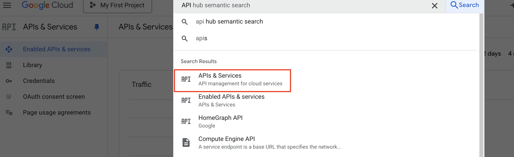 In the **Library** 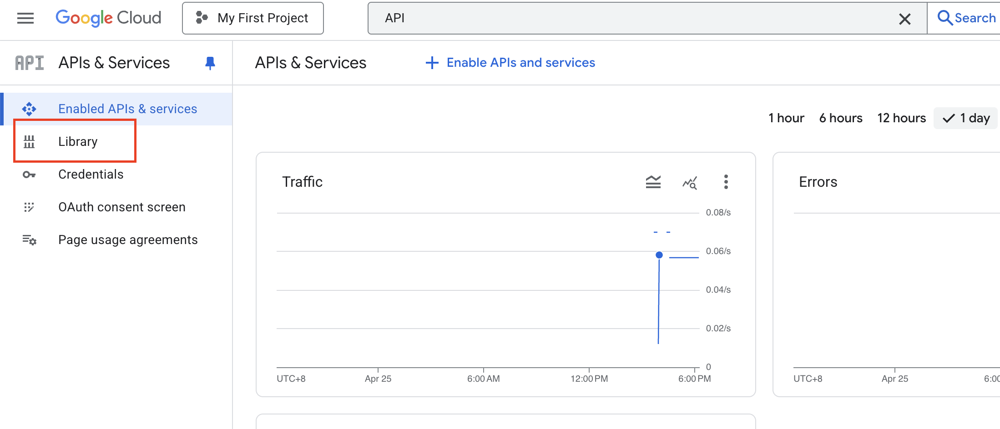, search for **Admin SDK API** 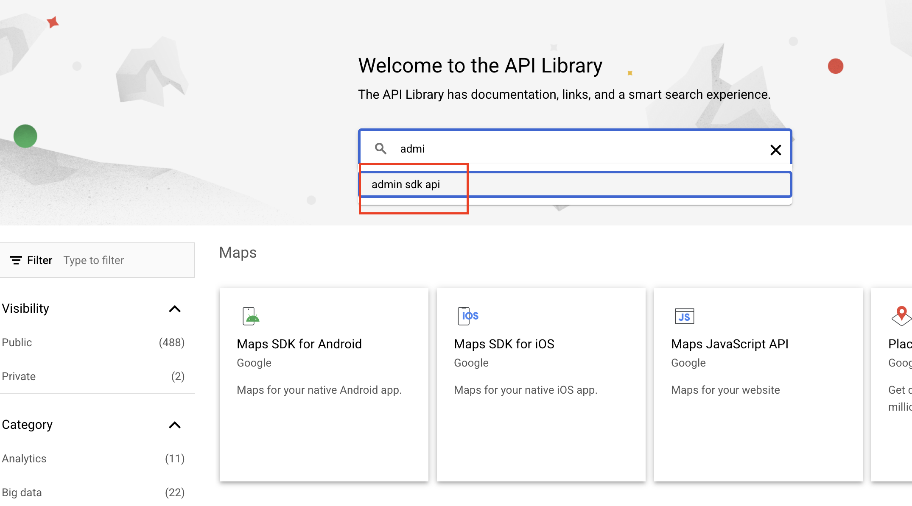, click and enable it 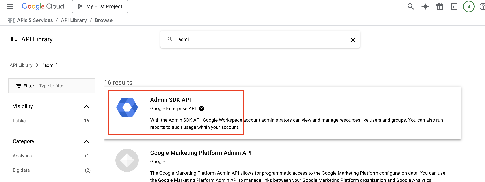.

3. After enabling the **Admin SDK API**, click **Manage** 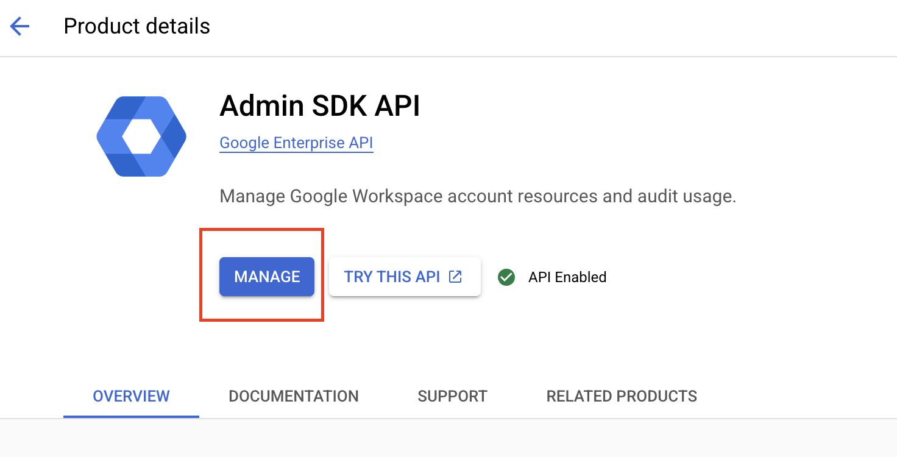.

4. Create an OAuth client 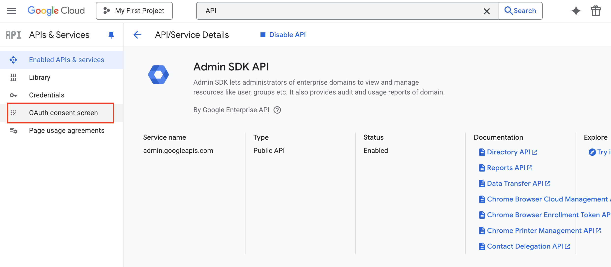. Click **Clients**, then **Create client** 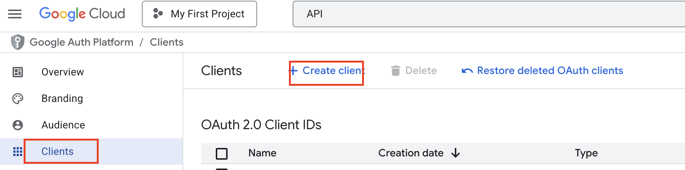.

5. In the application type, choose **Web application** 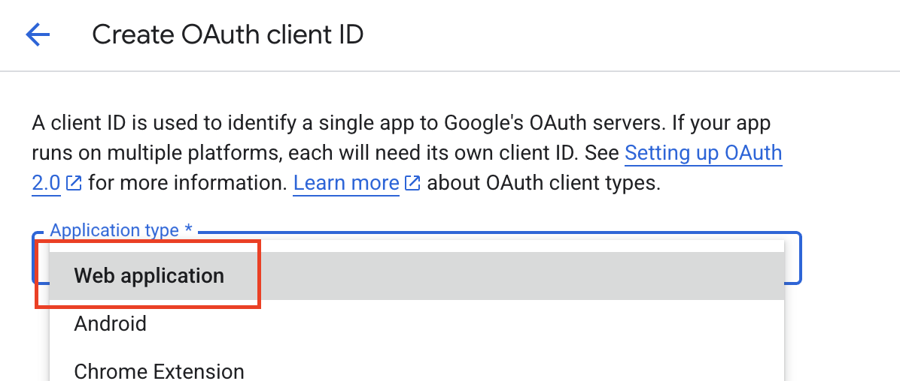. Fill in the **Name** (e.g., Sentinel) and **Authorized redirect URIs** to **https://portal.azure.com/TokenAuthorize/ExtensionName/Microsoft_Azure_Security_Insights** 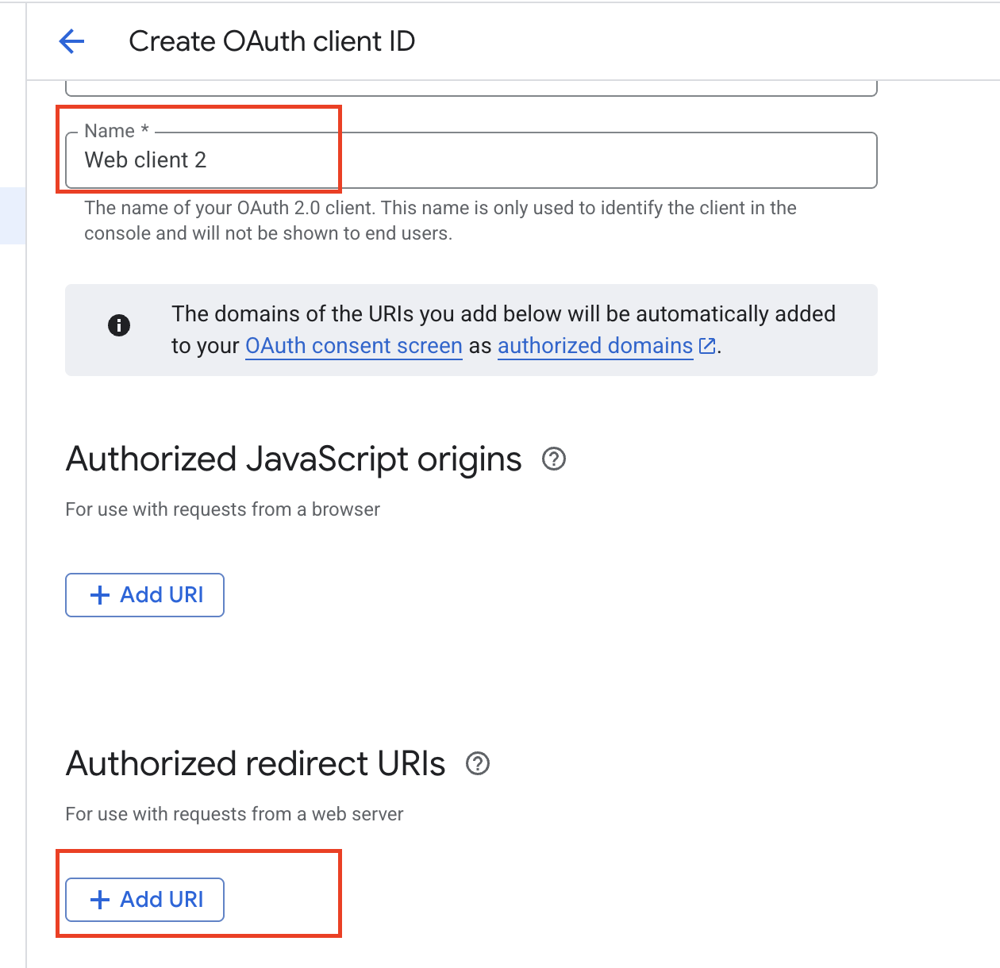.

6. Navigate to **Data access** 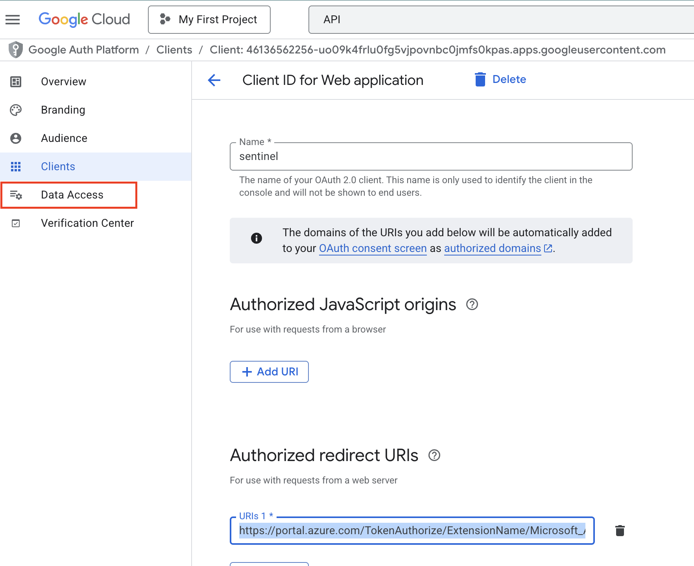, click **Add or remove scopes**, and select:
   - **https://www.googleapis.com/auth/admin.reports.audit.readonly**
   - **https://www.googleapis.com/auth/admin.reports.usage.readonly**
   ([reference](https://developers.google.com/workspace/admin/reports/auth?hl=zh-tw)) 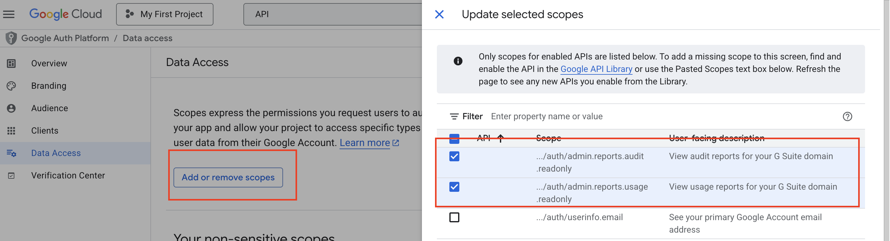.

7. To get the OAuth ID & secret 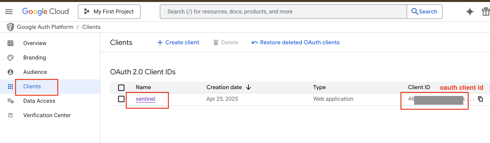, click the client name. You should be able to get info like this 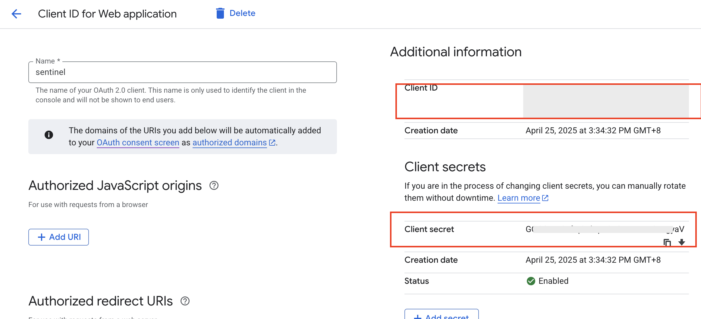. Copy this info, as you will fill it in the Sentinel connector in the next step.

## Step 2. Deploy Google Workspace connector to Sentinel
1. Deploy the connector to Azure:  
   

2. In the deployment wizard 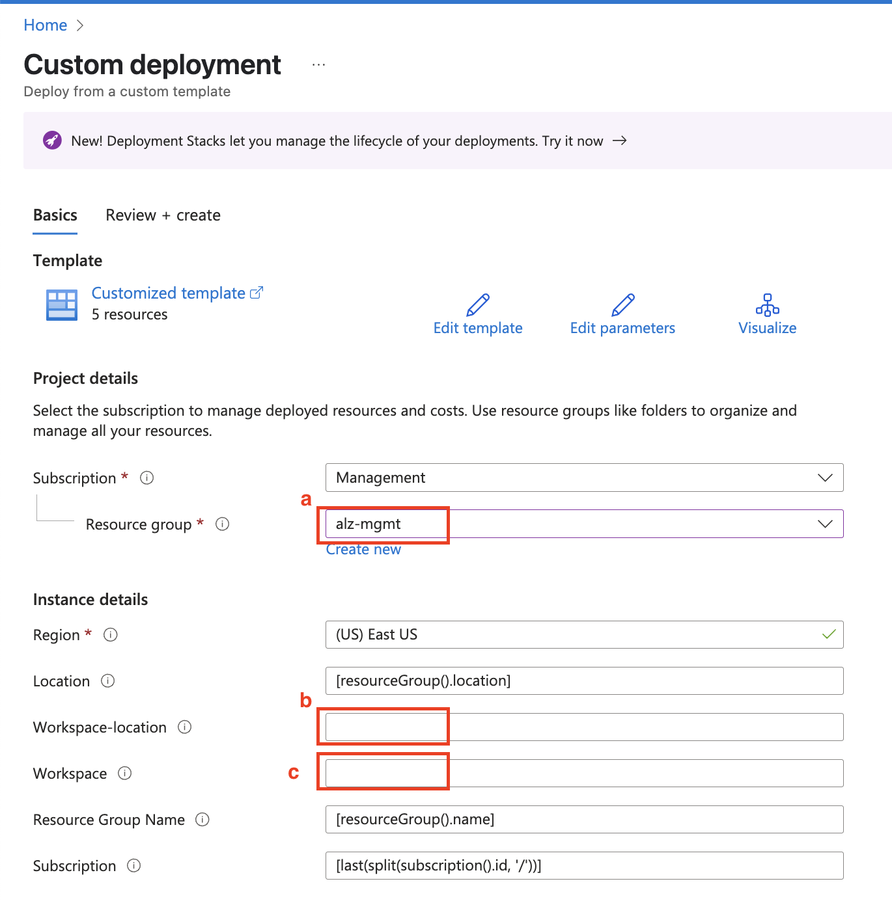:  
   a. Select the resource group containing Sentinel.  
   b. Choose the region of the Sentinel Log Analytics workspace (e.g., East US in the example).  
   c. Enter the name of the Sentinel Log Analytics workspace (e.g., alz-law).

3. Click the **Review + create** button and deploy.

4. In Sentinel, click **Data Connectors**, find the connector named **Google Workspace Activities (using REST API) (Preview)**, and then click **Open connector page** 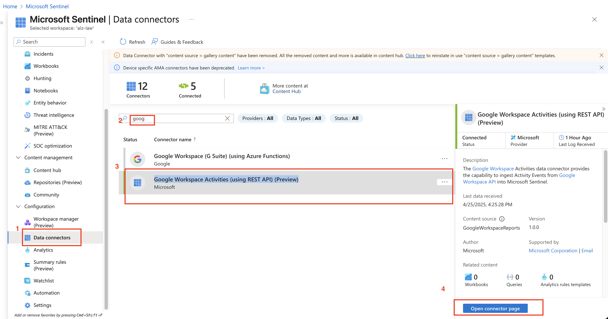.

5. In the connector page, fill in the OAuth client ID and secret in the text box 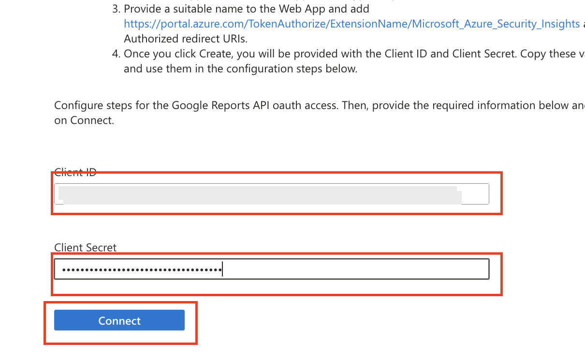. Then click **Connect**. You will be redirected to the Google login page in a pop-up window. Select the Google Admin account you used and log in 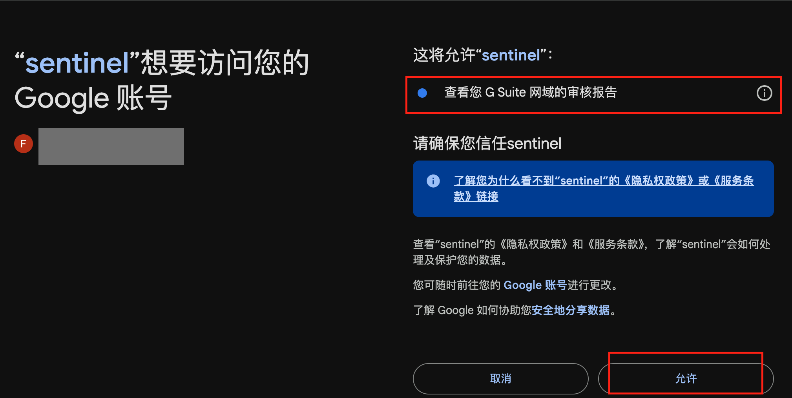. Review the permissions and allow access.

6. If configured correctly, you should see the connector resource provisioned. After some time, you will see data received 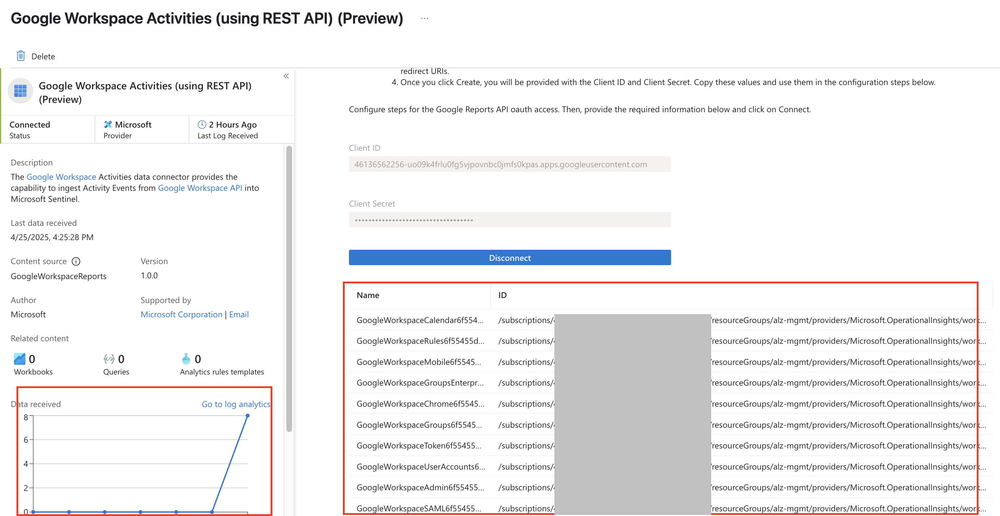.

7. you can also search data in log analytics table **GoogleWorkspaceReports_CL** as below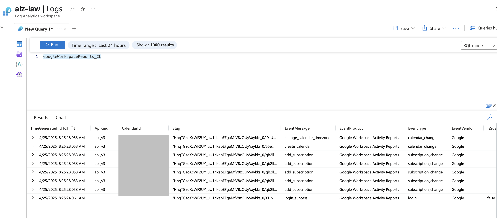
